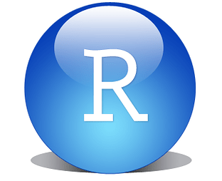

Instalación de R y Rstudio
================
Pepi Amodeo
Agosto 2022

<!--SETUP-->
<style> body {text-align: justify} </style>
<!--SOCIAL LINKS-->

``` marginfigure
[](https://github.com/pepiamodeo)
```

[Inicio](https://pepiamodeo.github.io/cursotallerIADO/)

Instituto Argentino de Oceanografía (CONICET UNS) Bahía Blanca,
Argentina

# Objetivos

<!--Obejtivos-->

<div class="fullwidth">

------------------------------------------------------------------------

<!--de qué va? que se hace en este tutorial? para quien está dirigido? objetivo-->
<!--3-4 líneas 50-80 palabras-->

-   Instalar `R`

-   Instalar `Rstudio`

-   Conocer material web vinculado con el desarrollo `R`, como software
    libre

<!-- captura/esquema sintético-->

------------------------------------------------------------------------

</div>

# R, Rstudio y el software libre

<!--concepto, definición, herramienta, paralelismo en otro software, necesidad inicial-->
<!--5-6 párrafos 300 palabras-->

`R` es un software libre y de código abierto disponible bajo una
Licencia Pública General
[GNU](https://en.wikipedia.org/wiki/GNU_General_Public_License).

``` marginfigure
_Software libre_ no es lo mismo que _software gratis_. 
```

`R` puede ser instalado y utilizado de manera gratuita. Las licencias
libres permiten a los/as usuarios/as usar, copiar, estudiar y modificar
el software de cualquier manera. De este modo, el software crece y
mejora gracias al aporte y las ideas de una comunidad. Esto se gestiona
en la forma de librerías que pueden ir instalándose como extensiones del
software base, las cuales se publican y acceden a través de la red de
archivos del proyecto de `R` llamado `CRAN` (The Comprehensive `R`
Archive Network). Además, cualquier usuario puede desarrollar una
librería o paquete y publicarlo sencillamente a través de un repositorio
personal como [Git-hub](https://github.com/).

`RStudio` es un entorno de desarrollo integrado para el lenguaje de
programación `R` (y otros) disponible también bajo una Licencia Pública
General (AGPL v3), accesible en ediciones tanto gratuitas como pagas.
Provee al usuario de una interfaz organizada y con herramientas que
facilitan y extienden las posibilidades de trabajo con `R`.

# Paso a paso

<!--desarrollo, procedimiento, lista de acciones-->
<!--formato lista 10 items imagenes, 2-3 capturas/esquemas,links a otras clases-->

Las siguientes demostraciones están hechas enfocadas en usuarios/as de
Windows 10. Para otros sistemas operativos, seguir las indicaciones en
los sitios de los desarrolladores.

## ¿Cómo instalar `R`? Descargar por primera vez.

``` marginfigure
https://www.r-project.org/
```

En la página web del proyecto de `R` *The R Project for Statistical
Computing* (link al margen derecho) se puede acceder a los links de
descarga y mucha información relacionada con el proyecto.

El siguiente gif te muestra las distintas pantallas por las que vas a
pasar.

1- Getting Started: clickear en “download R”

2- Seleccionar el mirror de Argentina Universidad Nacional de La Plata

3- “download R for Windows” (a menos que tengas otro sistema operativo)

4- “install R for the first time”

5- El link superior descargará la última versión (“Download R…”)


Una vez descargado, ejecutar el instalador y seguir los pasos (ante la
duda recomiendo ejecutarlo con permisos de administrador si es posible:
botón derecho/“Run as administrator”). En cada paso se pueden dejar las
opciones que aparecen por defecto y seguir adelante (sugerencia que solo
hago porque confío en el proyecto). `R` se instala en el directorio
indicado durante el proceso de instalación (comunmente en
`.../Archivos de Programa/R` y las liberías o paquetes en
`.../Documentos/R/win-library`.

## ¿Cómo instalar Rstudio?

``` marginfigure
https://rstudio.com/
```

Una vez instalado `R`, podemos proceder a instalar la interfaz
`Rstudio`. En e link del margen derecho, accedemos a su web. En la
sección de descargas seleccionar el software `Rstudio Desktop`. Una vez
descargado seguir las indicaciones (misma sugerencia que antes).


## ¿Cómo correrlo?

<!-- -->

De ahora en más, solo vamos a ejecutar el software `Rstudio`, por lo
tanto sólo nos va a importar tener un acceso directo a `Rstudio` a mano.

## Información sobre `R`

Dado que es un software en permanente desarrollo por una comunidad
creciente, existen muchas fuentes de donde obtener información para
saber cómo usarlo o cómo resolver dudas específicas. Recordá que la
búsqueda activa de ayuda y la consulta perminanete a estas fuentes son
parte de las reglas básicas de un/a usuario/a de `R`, y por supuesto la
colaboración con otros/as.

-   [Rhelp](https://www.r-project.org/help.html) La ayuda de `R` es el
    primer lugar.
-   [stack overflow](https://stackoverflow.com/)
-   [Rpubs](https://rpubs.com/)
-   [muuuuuuuchos
    libros](https://www.r-project.org/doc/bib/R-books.html)
-   [Cookbook R](http://www.cookbook-r.com/)
-   [R Graph Gallery](%5Bhttps://www.r-graph-gallery.com/%5D)

# Concluyendo

<!-- -->

Ahora ya está `R` instalado y lo utilizaremos a través de la interfaz de
`Rstudio`. Bienvenido/a a la fascinante (y ondulante) senda del software
libre para la exploración y el análisis de datos. Ahora a andar… sos
*libre*.

[Volver al índice](https://pepiamodeo.github.io/cursotallerIADO/)
